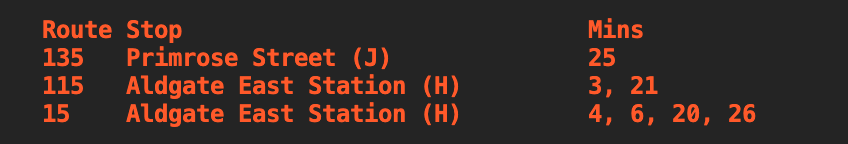

# bus

A simple CLI to check London bus arrivals from the terminal.



## Installation

### Linux or MacOS

You can install the latest version by running the following command in your terminal.

```bash
bash -c "$(curl -fsSL https://raw.githubusercontent.com/prnvbn/bus/main/installer.sh)"
```

Move the binary to a directory in your PATH. For e.g. `/usr/local/bin` on linux.

#### Enabling Command Autocompletion

To enable autocomplete, add the following to your `.bashrc` or `.bash_profile` file:

```bash
# you can also generate completions for zsh and fish shells by replacing bash with zsh or fish
source <(bus completion bash)
```

> NOTE: dont forget to restart your terminal or run `source ~/.bashrc`

If you want use an alias for bus, you can add the following to your `.bashrc` or `.bash_profile` file:

```bash
alias b=bus
source <(bus completion bash | sed 's/bus/c/g')
```

### Windows

Windows installation instructions are a WIP. In the meantime, you can download the latest release from the [releases page](https://github.com/prnvbn/bus/releases)

### Using Go

Run the following to install it as a go tool

```bash
go install github.com/prnvbn/bus@latest
```

### Notes

- Data sourced from [TfL Unified API](https://api.tfl.gov.uk/), rate limited at 50 requests per minute
